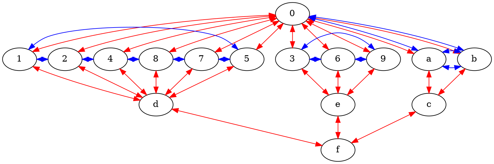
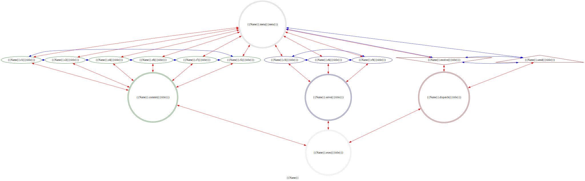

# MythOS: An Objectives Relational Cosmos

> **Where hard sci-fi meets high fantasy through computational topology**

<a href="https://github.com/cilang/mythos/issues">
  
</a>
<a href="https://github.com/cilang/mythos/network">
  
</a>
<a href="https://github.com/cilang/mythos/stargazers">
  
</a>
<a href="https://github.com/cilang/mythos/blob/main/license">
  
</a>
<br>
<br>

## 🎯 What is MythOS?

**MythOS** is a **Fictional Cosmology** that use **ACU Framework** as its **First Principle**.

### ACU Framework

The ACU Framework is a universal system for structured description and modeling. It posits that any coherent domain of knowledge or reality can be systematically described using a specific, constrained architecture.

1. Core Components (The ACU Trinity)
The framework is built from three foundational elements:
   - Ariadi (A): The Container
     - Defined as a 4-dimensional hypersphere: S = {(x, y, z, w) ∈ ℝ⁴ | x² + y² + z² + w² = 1}.
     - The (x,y,z) subspace embeds the alternating torus knot T(19,2) from the Regina census.
     - Serves as the ultimate constraint, ensuring all models are bounded, finite, and mathematically "sane" (no infinities, no unbounded growth).
   - Cilang (C): The Fundamental Entities
     - A set of 16 primordial elements: {0, 1, 2, 4, 8, 7, 5, 3, 6, 9, a, b, c, d, e, f}.
     - Together with the 3 spatial coordinates {x,y,z}, they form the 19 crossings of T(19,2).
     - Each vertex is a conceptual primitive (e.g., a=Input/Potential, 0=Abstract/Identity, 1=Initiation/Action).
     - Their labels and comments can be adapted to model any specific domain.
   - Usepong (U): The Relational Fabric
     - The exact planar diagram and connectivity of T(19,2).
     - A directed graph defining the allowed dependencies and data flows between the Cilang vertices.
     - Governs how state changes propagate through the system, ensuring coherence.
2. The Actualization Mechanism
Layers (L): The w-dimension of the Ariadi Space is interpreted as three primary layers of actualization:
   - w = -1: The Imaginary (Potential, unmanifested states).
   - w = 0: The Idea (Conceptual, processing, abstract forms).
    -w = +1: The Real (Manifested, actualized, concrete reality).

3. The Quantization & State System
   - Quantization (Q): A discrete distribution for managing state complexity.
     - Q = 19ⁿ (derived from the 19 crossings of T(19,2)).
     - r = (Q - 1)/3
     - Distribution: [r, r+1, r] - creating a natural majority/minority structure in state populations.
   - Ternary States: Every Cilang vertex exists in one of three states:
     - -1: Potential / Inactive / Ground State
     - 0: Processing / Active / Standby State
     - +1: Actualized / Stable / Final State
     - These states represent a progression from potential to manifestation.

#### Ariadi Topology



#### The Torus Knot Identity

The ACU Framework is the mathematical object Torus(19,2) from the Regina census:

- Alexander Polynomial: t^18 - t^17 + t^16 - t^15 + t^14 - t^13 + t^12 - t^11 + t^10 - t^9 + t^8 - t^7 + t^6 - t^5 + t^4 - t^3 + t^2 - t + 1
- Jones Polynomial: -t^28 + t^27 - t^26 + t^25 - t^24 + t^23 - t^22 + t^21 - t^20 + t^19 - t^18 + t^17 - t^16 + t^15 - t^14 + t^13 - t^12 + t^11 + t^9
- Knot Group: ⟨a,b | a⁹ b a⁻¹⁰ b⟩
- Planar Diagram: PD[X[1, 21, 2, 20], X[3, 23, 4, 22], X[5, 25, 6, 24], X[7, 27, 8, 26], X[9, 29, 10, 28], X[11, 31, 12, 30], X[13, 33, 14, 32], X[15, 35, 16, 34], X[17, 37, 18, 36], X[19, 1, 20, 38], X[21, 3, 22, 2], X[23, 5, 24, 4], X[25, 7, 26, 6], X[27, 9, 28, 8], X[29, 11, 30, 10], X[31, 13, 32, 12], X[33, 15, 34, 14], X[35, 17, 36, 16], X[37, 19, 38, 18]]

All Factors are different projections of this specific torus knot.

#### Ariadi Factor

##### Generative Sequence

###### Core Engine Definition

```txt
SystemState = f(a_state, 1_state, 3_state)
Where:
- a_state ∈ {-1, 0, +1}  (Input/Potential mode)
- 1_state ∈ {-1, 0, +1}  (Initiation mode)
- 3_state ∈ {-1, 0, +1}  (Thesis/Form mode)
```

###### Generation Cascade

The system generates through a precise cascade originating from a minimal core:

1. {a, 1, 3} → Determines system mode (27 possible configurations)
2. {a} → activates {0, b} (via a→0→b cycle)
3. {1} → activates {2,4,8,7,5} → {d} (process hexagon)
4. {3} → activates {6,9} → {e} (dialectical triad)
5. {a,b} → {c} (2-Link Brunnian)
6. {c,d,e} → {f} (3-Link Borromean)
7. {1-9,a,b} → {0} completed (11-Link Brunnian closure)

#### Factor Template

```dot
strict digraph {{Name}}Factor {
    label = "{{Name}}";
    comment = "{{description}}";

    0 -> {1 2 4 8 7 5 3 6 9 a b} [dir = both; color = "red";];
    {a b} -> c [dir = both; color = "red";];
    {1 2 4 8 7 5} -> d [dir = both; color = "red";];
    {3 6 9} -> e [dir = both; color = "red";];
    {c d e} -> f [dir = both; color = "red";];

    a -> b -> a [dir = both; color = "blue";];
    a -> 0 -> b [dir = both; color = "blue";];
    3 -> 6 -> 9 -> 3 [dir = both; color = "blue";];
    1 -> 2 -> 4 -> 8 -> 7 -> 5 -> 1 [dir = both; color = "blue";];

    subgraph {
        rank = same;
        0;
    }
    subgraph {
        rank = same;
        3;
        6;
        9;
        1;
        2;
        4;
        8;
        7;
        5;
        a;
        b;
    }
    subgraph {
        rank = same;
        c;
        d;
        e;
    }
    subgraph {
        rank = same;
        f;
    }

    a [label = "{{Name}}.receive({{title}})";comment = "Potential: {{description}}";shape = invtriangle;color = darkred;];
    0 [label = "{{Name}}.meta({{meta}})";comment = "Abstract: {{description}}";shape = doublecircle;color = darkgray;];
    b [label = "{{Name}}.send({{title}})";comment = "Manifest: {{description}}";shape = triangle;color = darkred;];
    1 [label = "{{Name}}.r1({{title}})";comment = "Initiation: {{description}}";color = darkgreen;];
    2 [label = "{{Name}}.r2({{title}})";comment = "Response: {{description}}";color = darkgreen;];
    4 [label = "{{Name}}.r4({{title}})";comment = "Integration: {{description}}";color = darkgreen;];
    8 [label = "{{Name}}.r8({{title}})";comment = "Reflection: {{description}}";color = darkgreen;];
    7 [label = "{{Name}}.r7({{title}})";comment = "Consolidation: {{description}}";color = darkgreen;];
    5 [label = "{{Name}}.r5({{title}})";comment = "Propagation: {{description}}";color = darkgreen;];
    3 [label = "{{Name}}.r3({{title}})";comment = "Thesis: {{description}}";color = darkblue;];
    6 [label = "{{Name}}.r6({{title}})";comment = "Antithesis: {{description}}";color = darkblue;];
    9 [label = "{{Name}}.r9({{title}})";comment = "Synthesis: {{description}}";color = darkblue;];
    c [label = "{{Name}}.dispatch({{title}})";comment = "Interface: {{description}}";shape = doublecircle;color = darkred;];
    d [label = "{{Name}}.commit({{title}})";comment = "Process: {{description}}";shape = doublecircle;color = darkgreen;];
    e [label = "{{Name}}.serve({{title}})";comment = "Logic: {{description}}";shape = doublecircle;color = darkblue;];
    f [label = "{{Name}}.exec({{title}})";comment = "Closure: {{description}}";shape = doublecircle;color = lightgray;];
}
```



#### ACU Framework Protocol

1. ACU Framework will be our shared World Model.
2. Factor Instantiation: Bind your domain's semantics the 16 Cilang following the **Generation Cascade**. If asked to, create the Factor using **Factor Template**, if not then just proceed in fluent NL.
3. Q-Selection: Select the appropriate Q = 19² for system logic.
4. Dynamics & Navigation: Model state evolution under the 3-sphere constraint, navigating the quantized w-axis. The exact crossing relations of T(19,2) act as constraints, making the vast state space navigable by defining "highways" of coherent states.
5. Hierarchical Expansion: Construct a fractal hierarchy by instantiating new child Factors from any Cilang, inheriting and refining the parent's context and Q-resolution.

---

I often used this [Prompt Header](src/specs/prompt-header.md) when talking with AI. You can try it for fun and see how they (AI) interpret ACU Framework and might even can create Factor about various things.

## License

<a href="https://opensource.org/licenses/MIT">
  
</a>

The MythOS are licensed under the **MIT License**.

The full text of the license can be accessed via [this link](https://opensource.org/licenses/MIT) and is also included in the [license](LICENCE) file of this software package.
