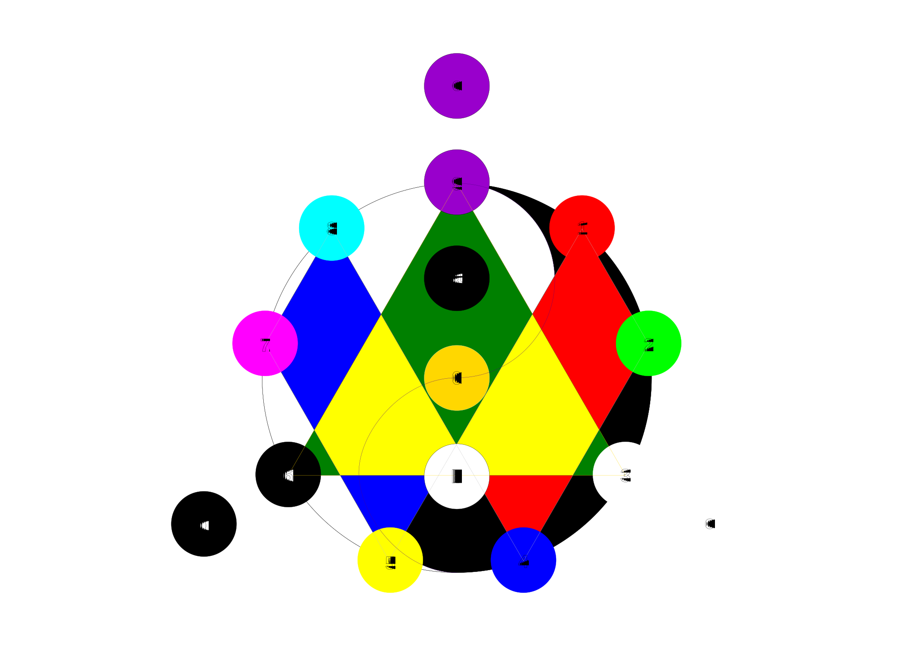

# MythOS: A Sparklet Cosmology

> **Where hard sci-fi meets high fantasy through computational topology**

 
 

## 🎯 What is MythOS?

**MythOS** is a **Fictional Cosmology** that use **Sparklet Topology** and **Sparklet Space** as its **First Principle**.

### Sparklet Space

**Mathematical Definition:**

S = {(x,y,z,w) ∈ ℝ⁴ | x² + y² + z² + w² = 1}

w ∈ [w₀, w₁, w₂, ..., w₁₅]  # 16-fold multiplexed aspect vector

**Probability Quantization:**
- Default: `q = 137` probability multitudes
- Requirement: `2n+1`
- Distribution: Balanced Ternary `68-1-68` across [-1, 0, +1]

### Sparklet Topology

**Invariant Structure:**
- 16 Spark vertices: `{0,1,2,3,4,5,6,7,8,9,a,b,c,d,e,f}`
- 35 Arc edges with 3 morphism types: `{IN, OUT, REC}`
- Fixed relational patterns

**Template:**

```dot
strict digraph Cilang {
    style = filled;
    color = lightgray;
    node [shape = circle; style = filled; color = lightgreen;];
    edge [color = darkgray;];
    label = "{{Name}}";
    comment = "{{descriptions}}";

    cilang_0_t [label = "{{Name}}.meta({{meta}})";comment = "Abstract: {{descriptions}}";shape = doublecircle;color = darkgray;];
    cilang_1_t [label = "{{Name}}.r1({{title}})";comment = "Initiation: {{descriptions}}";color = darkgreen;];
    cilang_2_t [label = "{{Name}}.r2({{title}})";comment = "Response: {{descriptions}}";color = darkgreen;];
    cilang_4_t [label = "{{Name}}.r4({{title}})";comment = "Integration: {{descriptions}}";color = darkgreen;];
    cilang_8_t [label = "{{Name}}.r8({{title}})";comment = "Reflection: {{descriptions}}";color = darkgreen;];
    cilang_7_t [label = "{{Name}}.r7({{title}})";comment = "Consolidation: {{descriptions}}";color = darkgreen;];
    cilang_5_t [label = "{{Name}}.r5({{title}})";comment = "Propagation: {{descriptions}}";color = darkgreen;];
    cilang_3_t [label = "{{Name}}.r3({{title}})";comment = "Thesis: {{descriptions}}";color = darkblue;];
    cilang_6_t [label = "{{Name}}.r6({{title}})";comment = "Antithesis: {{descriptions}}";color = darkblue;];
    cilang_9_t [label = "{{Name}}.r9({{title}})";comment = "Synthesis: {{descriptions}}";color = darkblue;];
    cilang_a_t [label = "{{Name}}.receive({{title}})";comment = "Potential: {{descriptions}}";shape = invtriangle;color = darkred;];
    cilang_b_t [label = "{{Name}}.send({{title}})";comment = "Manifest: {{descriptions}}";shape = triangle;color = darkred;];
    cilang_c_t [label = "{{Name}}.dispatch({{title}})";comment = "Why-Who: {{descriptions}}";shape = doublecircle;color = darkred;];
    cilang_d_t [label = "{{Name}}.commit({{title}})";comment = "What-How: {{descriptions}}";shape = doublecircle;color = darkgreen;];
    cilang_e_t [label = "{{Name}}.serve({{title}})";comment = "When-Where: {{descriptions}}";shape = doublecircle;color = darkblue;];
    cilang_f_t [label = "{{Name}}.exec({{title}})";comment = "Which-Closure: {{descriptions}}";shape = doublecircle;color = lightgray;];

    cilang_a_t -> cilang_0_t [label = "IN"; comment = "{{descriptions}}"; color = darkred; constraint = false;];
    cilang_0_t -> cilang_b_t [label = "OUT"; comment = "{{descriptions}}"; color = darkred;];
    cilang_0_t -> cilang_3_t [label = "REC"; comment = "{{descriptions}}"; color = darkblue; dir = both;];
    cilang_0_t -> cilang_6_t [label = "REC"; comment = "{{descriptions}}"; color = darkblue; dir = both;];
    cilang_0_t -> cilang_9_t [label = "REC"; comment = "{{descriptions}}"; color = darkblue; dir = both;];
    cilang_0_t -> cilang_1_t [label = "REC"; comment = "{{descriptions}}"; color = darkgreen; dir = both;];
    cilang_0_t -> cilang_2_t [label = "REC"; comment = "{{descriptions}}"; color = darkgreen; dir = both;];
    cilang_0_t -> cilang_4_t [label = "REC"; comment = "{{descriptions}}"; color = darkgreen; dir = both;];
    cilang_0_t -> cilang_8_t [label = "REC"; comment = "{{descriptions}}"; color = darkgreen; dir = both;];
    cilang_0_t -> cilang_7_t [label = "REC"; comment = "{{descriptions}}"; color = darkgreen; dir = both;];
    cilang_0_t -> cilang_5_t [label = "REC"; comment = "{{descriptions}}"; color = darkgreen; dir = both;];

    cilang_a_t -> cilang_c_t [label = "REC"; comment = "{{descriptions}}"; color = darkred; dir = both;];
    cilang_b_t -> cilang_c_t [label = "REC"; comment = "{{descriptions}}"; color = darkred; dir = both;];
    cilang_1_t -> cilang_d_t [label = "REC"; comment = "{{descriptions}}"; color = darkgreen; dir = both;];
    cilang_2_t -> cilang_d_t [label = "REC"; comment = "{{descriptions}}"; color = darkgreen; dir = both;];
    cilang_4_t -> cilang_d_t [label = "REC"; comment = "{{descriptions}}"; color = darkgreen; dir = both;];
    cilang_8_t -> cilang_d_t [label = "REC"; comment = "{{descriptions}}"; color = darkgreen; dir = both;];
    cilang_7_t -> cilang_d_t [label = "REC"; comment = "{{descriptions}}"; color = darkgreen; dir = both;];
    cilang_5_t -> cilang_d_t [label = "REC"; comment = "{{descriptions}}"; color = darkgreen; dir = both;];
    cilang_3_t -> cilang_e_t [label = "REC"; comment = "{{descriptions}}"; color = darkblue; dir = both;];
    cilang_6_t -> cilang_e_t [label = "REC"; comment = "{{descriptions}}"; color = darkblue; dir = both;];
    cilang_9_t -> cilang_e_t [label = "REC"; comment = "{{descriptions}}"; color = darkblue; dir = both;];

    cilang_1_t -> cilang_2_t [label = "REC"; comment = "{{descriptions}}"; color = darkgreen; dir = both; style = dashed; constraint = false;];
    cilang_2_t -> cilang_4_t [label = "REC"; comment = "{{descriptions}}"; color = darkgreen; dir = both; style = dashed; constraint = false;];
    cilang_4_t -> cilang_8_t [label = "REC"; comment = "{{descriptions}}"; color = darkgreen; dir = both; style = dashed; constraint = false;];
    cilang_8_t -> cilang_7_t [label = "REC"; comment = "{{descriptions}}"; color = darkgreen; dir = both; style = dashed; constraint = false;];
    cilang_7_t -> cilang_5_t [label = "REC"; comment = "{{descriptions}}"; color = darkgreen; dir = both; style = dashed; constraint = false;];
    cilang_5_t -> cilang_1_t [label = "REC"; comment = "{{descriptions}}"; color = darkgreen; dir = both; style = dashed; constraint = false;];
    cilang_3_t -> cilang_6_t [label = "REC"; comment = "{{descriptions}}"; color = darkblue; dir = both; style = dashed; constraint = false;];
    cilang_6_t -> cilang_9_t [label = "REC"; comment = "{{descriptions}}"; color = darkblue; dir = both; style = dashed; constraint = false;];
    cilang_9_t -> cilang_3_t [label = "REC"; comment = "{{descriptions}}"; color = darkblue; dir = both; style = dashed; constraint = false;];
    cilang_a_t -> cilang_b_t [label = "REC"; comment = "{{descriptions}}"; color = darkred; dir = both; style = dashed; constraint = false;];

    cilang_c_t -> cilang_f_t [label = "REC"; comment = "{{descriptions}}"; color = darkred; dir = both;];
    cilang_d_t -> cilang_f_t [label = "REC"; comment = "{{descriptions}}"; color = darkgreen; dir = both;];
    cilang_e_t -> cilang_f_t [label = "REC"; comment = "{{descriptions}}"; color = darkblue; dir = both;];
}
```

---

Oh! Almost forgot, The **Sparklet Topology** is just one amongst hypothetically who-knows-how-many _Invariant Topology_ that inhabits **Sparklet Space**.

## Prior Art Declaration

This specification documents prior art for:
- Sparklet Topology (16-vertex, 35-edge computational graph)
- Sparklet Space (3-sphere constrained manifold with 16-fold w-multiplex)
- Balanced ternary quantization with 137 probability multitudes

These patterns draw from established mathematical principles including:
- Poincaré Conjecture/Theorem (3-sphere topology)
- Flower of Life geometry (19-fold sacred pattern)  
- Fine-structure constant (1/137 quantum relationships)
- Brunnian Link and Borromean Rings 

## License

The MythOS are licensed under the **MIT License**.

The full text of the license can be accessed via [this link](https://opensource.org/licenses/MIT) and is also included in the [license](LICENCE) file of this software package.
