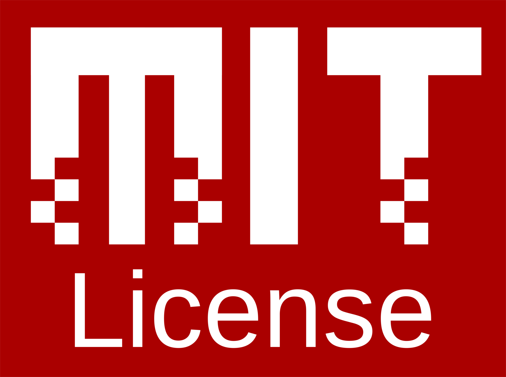

# MythOS: Sparklet Cosmology Framework

> **Where hard sci-fi meets high fantasy through computational topology**

<a href="https://github.com/cilang/mythos/issues">
  
</a>
<a href="https://github.com/cilang/mythos/network">
  
</a>
<a href="https://github.com/cilang/mythos/stargazers">
  
</a>
<a href="https://github.com/cilang/mythos/blob/main/license">
  
</a>
<br>
<br>

## 🎯 What is MythOS?

MythOS is a **Fictional Cosmology** that uses an **Sparklet Topology** and **Sparklet Space** to represent everything from quantum fields to magical systems as computable **Factor**.

## 🏗️ Architecture

### Sparklet Topology

Every concept in MythOS is a **Factor** with identical 16v/35e structure:

```
SPARKLET CONJECTURE

1. TOPOLOGY: K16 with 35/120 edges is computationally optimal
2. SPACE: 4D coordinates (x,y,z,w) on S³ with x²+y²+z²+w²=1  
3. RESOLUTION: 137-step balanced ternary (68-1-68)
4. LAYERS: w = -1 (Imaginary), 0 (Idea), +1 (Real)
5. ACCURACY: 96.6% maximum prediction limit
6. CONSTANTS: Emerge from optimal computation (α = 1/137)

That's it. That's the whole thing.
```


---

**MythOS**: Because the universe shouldn't have domain boundaries. 🚀✨

## License

<a href="https://opensource.org/licenses/MIT">
  
</a>

The MythOS are licensed under the **MIT License**.

The full text of the license can be accessed via [this link](https://opensource.org/licenses/MIT) and is also included in the [license](LICENCE) file of this software package.
