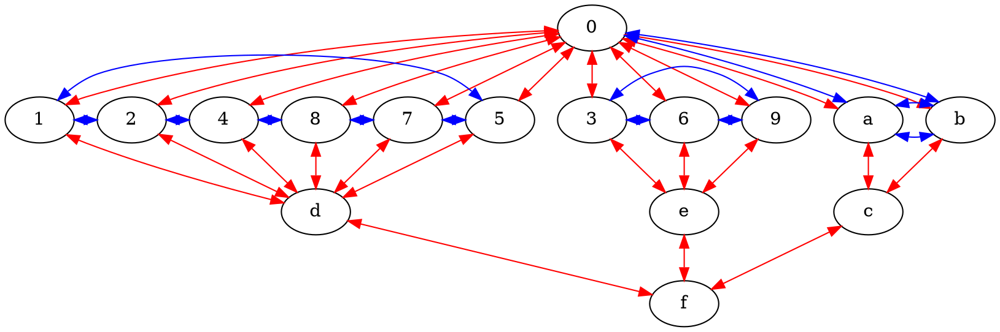

# ACU Framework

The ACU Framework is a universal system for structured description and modeling. It posits that any coherent domain of knowledge or reality can be systematically described using a specific, constrained architecture.

1. Core Components (The ACU Trinity)
The framework is built from three foundational elements:
   - Ariadi (A): The Container
     - Defined as a 4-dimensional hypersphere: S = {(x, y, z, w) ∈ ℝ⁴ | x² + y² + z² + w² = 1}.
     - Serves as the ultimate constraint, ensuring all models are bounded, finite, and mathematically "sane" (no infinities, no unbounded growth).
   - Cilang (C): The Fundamental Entities
     - A set of 16 primordial elements: {0, 1, 2, 4, 8, 7, 5, 3, 6, 9, a, b, c, d, e, f}.
     - Each vertex is a conceptual primitive (e.g., a=Input/Potential, 0=Abstract/Identity, 1=Initiation/Action).
     - Their labels and comments can be adapted to model any specific domain.
   - Usepong (U): The Relational Fabric
     - A directed graph defining the allowed dependencies and data flows between the Cilang vertices.
     - Governs how state changes propagate through the system, ensuring coherence.
2. The Actualization Mechanism
Layers (L): The w-dimension of the Ariadi Space is interpreted as three primary layers of actualization:
   - w = -1: The Imaginary (Potential, unmanifested states).
   - w = 0: The Idea (Conceptual, processing, abstract forms).
    -w = +1: The Real (Manifested, actualized, concrete reality).

3. The Quantization & State System
   - Quantization (Q): A discrete distribution for managing state complexity.
     - Q = 19ⁿ (using a prime base for even distribution).
     - r = (Q - 1)/3
     - Distribution: [r, r+1, r] - creating a natural majority/minority structure in state populations.
   - Ternary States: Every Cilang vertex exists in one of three states:
     - -1: Potential / Inactive / Ground State
     - 0: Processing / Active / Standby State
     - +1: Actualized / Stable / Final State
     - These states represent a progression from potential to manifestation.

## Ariadi Topology



## Ariadi Factor

### Generative Sequence

#### Core Engine Definition

```txt
SystemState = f(a_state, 1_state, 3_state)
Where:
- a_state ∈ {-1, 0, +1}  (Input/Potential mode)
- 1_state ∈ {-1, 0, +1}  (Initiation mode)
- 3_state ∈ {-1, 0, +1}  (Thesis/Form mode)
```

#### Generation Cascade

The system generates through a precise cascade originating from a minimal core:

1. {a, 1, 3} → Determines system mode (27 possible configurations)
2. {a} → activates {0, b} (via a→0→b cycle)
3. {1} → activates {2,4,8,7,5} → {d} (process hexagon)
4. {3} → activates {6,9} → {e} (dialectical triad)
5. {a,b} → {c} (2-Link Brunnian)
6. {c,d,e} → {f} (3-Link Borromean)
7. {1-9,a,b} → {0} completed (11-Link Brunnian closure)
