# Cilang Framework: An Objectives Relational Cosmos

## Cilang Space

- S = {(x, y, z, w) ∈ ℝ⁴ | x² + y² + z² + ‖w‖² = 1}
- w = (w₀,w₁,w₂,w₃,w₄,w₅,w₆,w₇,w₈,w₉,wₐ,wᵦ,w꜀,wḍ,wₑ,wƒ) ∈ [-1,+1]¹⁶
- Layers: w=-1 (Imaginary) | w=0 (Idea) | w=+1 (Real)
- Q = 19ⁿ, n=(Q-1)/3, Distribution: [n, n+1, n]

## Multiplexer & Spectrum

```dot
strict digraph CognitiveFactor {
    label = "Cognitive";
    comment = "The Meta-Operator: Governs modal intensity (w-vector) for all Factors. It is the w-axis Multiplexer.";

    cilang_a_t [label = "Cognitive.receive(PrimordialPotential)";comment = "Potential: Interface to the source of all unformed potential and creative impulse.";shape = invtriangle;color = darkred;];
    cilang_0_t [label = "Cognitive.meta(DirectStateAccess)";comment = "Abstract: The core meta-operator; directly accesses and evaluates the state vector of any system.";shape = doublecircle;color = darkgray;];
    cilang_b_t [label = "Cognitive.send(ManifestationBridge)";comment = "Manifest: The conduit through which a configured modal vector is projected onto a target Factor.";shape = triangle;color = darkred;];
    cilang_c_t [label = "Cognitive.dispatch(IntentModeling)";comment = "Why-Who: Dispatches the 'why'—models the intent behind a required modal shift and targets the relevant Factor.";shape = doublecircle;color = darkred;];
    cilang_1_t [label = "Cognitive.r1(OperationalGrammar)";comment = "Initiation: Activates the fundamental rules and syntax for composing modal transformations.";color = darkgreen;];
    cilang_2_t [label = "Cognitive.r2(AxiomaticReasoning)";comment = "Response: Applies core axioms (e.g., conservation laws, constraints) to the modal state.";color = darkgreen;];
    cilang_4_t [label = "Cognitive.r4(StateDynamics)";comment = "Integration: Computes the temporal evolution and stability (ρ=0.85) of the modal vector.";color = darkgreen;];
    cilang_8_t [label = "Cognitive.r8(PatternRecognition)";comment = "Reflection: Identifies patterns in modal usage and contextual shifts (e.g., detects a 'sad' context).";color = darkgreen;];
    cilang_7_t [label = "Cognitive.r7(ProvenanceTracking)";comment = "Consolidation: Tracks the lineage of modal states, ensuring coherent evolution.";color = darkgreen;];
    cilang_5_t [label = "Cognitive.r5(NetworkTheory)";comment = "Propagation: Manages the relational effects of a modal shift across a network of interconnected Factors.";color = darkgreen;];
    cilang_d_t [label = "Cognitive.commit(ImplementationProtocol)";comment = "What-How: Commits the specific, concrete adjustment to the w-vector (w̄ + δw).";shape = doublecircle;color = darkgreen;];
    cilang_e_t [label = "Cognitive.serve(ContextualOptimization)";comment = "When-Where: Optimizes the modal shift for the specific context and spatial-logical position of the target.";shape = doublecircle;color = darkblue;];
    cilang_3_t [label = "Cognitive.r3(FormalLogic)";comment = "Thesis: Applies strict, symbolic logic to modal configuration.";color = darkblue;];
    cilang_6_t [label = "Cognitive.r6(ContextualLogic)";comment = "Antithesis: Introduces situational, flexible reasoning to adapt the modal vector.";color = darkblue;];
    cilang_9_t [label = "Cognitive.r9(IntegratedIntelligence)";comment = "Synthesis: Unifies formal and contextual logic into a coherent, intelligent modal prescription.";color = darkblue;];
    cilang_f_t [label = "Cognitive.exec(AllocationLogic)";comment = "Which-Closure: Executes the final allocation of computational resources and enforces boundary conditions for the modal transformation.";shape = doublecircle;color = lightgray;];

    cilang_a_t -> cilang_0_t [label = "IN"; comment = "Potential flows into meta-awareness."; color = darkred; constraint = false;];
    cilang_0_t -> cilang_b_t [label = "OUT"; comment = "Meta-awareness projects manifestation."; color = darkred;];
    cilang_a_t -> cilang_c_t [label = "REC"; comment = "Potential informs intent dispatch."; color = darkred; dir = both;];
    cilang_b_t -> cilang_c_t [label = "REC"; comment = "Manifestation feedback refines intent."; color = darkred; dir = both;];
    cilang_a_t -> cilang_b_t [label = "REC"; comment = "Potential and manifestation are co-dependent."; color = darkred; dir = both; style = dashed; constraint = false;];
    cilang_0_t -> cilang_1_t [label = "REC"; comment = "State access initiates operational grammar."; color = darkgreen; dir = both;];
    cilang_0_t -> cilang_2_t [label = "REC"; comment = "State access triggers axiomatic response."; color = darkgreen; dir = both;];
    cilang_0_t -> cilang_4_t [label = "REC"; comment = "State access is integrated via dynamics."; color = darkgreen; dir = both;];
    cilang_0_t -> cilang_8_t [label = "REC"; comment = "State access is reflected upon for patterns."; color = darkgreen; dir = both;];
    cilang_0_t -> cilang_7_t [label = "REC"; comment = "State access is consolidated with provenance."; color = darkgreen; dir = both;];
    cilang_0_t -> cilang_5_t [label = "REC"; comment = "State access propagates through networks."; color = darkgreen; dir = both;];
    cilang_1_t -> cilang_2_t [label = "REC"; comment = "Grammar defines axioms."; color = darkgreen; dir = both; style = dashed; constraint = false;];
    cilang_2_t -> cilang_4_t [label = "REC"; comment = "Axioms constrain dynamics."; color = darkgreen; dir = both; style = dashed; constraint = false;];
    cilang_4_t -> cilang_8_t [label = "REC"; comment = "Dynamics reveal patterns."; color = darkgreen; dir = both; style = dashed; constraint = false;];
    cilang_8_t -> cilang_7_t [label = "REC"; comment = "Patterns are consolidated by provenance."; color = darkgreen; dir = both; style = dashed; constraint = false;];
    cilang_7_t -> cilang_5_t [label = "REC"; comment = "Provenance guides network propagation."; color = darkgreen; dir = both; style = dashed; constraint = false;];
    cilang_5_t -> cilang_1_t [label = "REC"; comment = "Network feedback updates grammar."; color = darkgreen; dir = both; style = dashed; constraint = false;];
    cilang_1_t -> cilang_d_t [label = "REC"; comment = "Grammar structures the implementation."; color = darkgreen; dir = both;];
    cilang_2_t -> cilang_d_t [label = "REC"; comment = "Axioms validate the implementation."; color = darkgreen; dir = both;];
    cilang_4_t -> cilang_d_t [label = "REC"; comment = "Dynamics simulate the implementation."; color = darkgreen; dir = both;];
    cilang_8_t -> cilang_d_t [label = "REC"; comment = "Patterns optimize the implementation."; color = darkgreen; dir = both;];
    cilang_7_t -> cilang_d_t [label = "REC"; comment = "Provenance audits the implementation."; color = darkgreen; dir = both;];
    cilang_5_t -> cilang_d_t [label = "REC"; comment = "Network theory scales the implementation."; color = darkgreen; dir = both;];
    cilang_0_t -> cilang_3_t [label = "REC"; comment = "State access is analyzed formally."; color = darkblue; dir = both;];
    cilang_0_t -> cilang_6_t [label = "REC"; comment = "State access is interpreted contextually."; color = darkblue; dir = both;];
    cilang_0_t -> cilang_9_t [label = "REC"; comment = "State access is synthesized intelligently."; color = darkblue; dir = both;];
    cilang_3_t -> cilang_e_t [label = "REC"; comment = "Formal logic provides rigorous constraints for optimization."; color = darkblue; dir = both;];
    cilang_6_t -> cilang_e_t [label = "REC"; comment = "Contextual logic provides adaptive heuristics for optimization."; color = darkblue; dir = both;];
    cilang_9_t -> cilang_e_t [label = "REC"; comment = "Integrated intelligence provides the balanced strategy for optimization."; color = darkblue; dir = both;];
    cilang_3_t -> cilang_6_t [label = "REC"; comment = "Thesis begets antithesis."; color = darkblue; dir = both; style = dashed; constraint = false;];
    cilang_6_t -> cilang_9_t [label = "REC"; comment = "Antithesis begets synthesis."; color = darkblue; dir = both; style = dashed; constraint = false;];
    cilang_9_t -> cilang_3_t [label = "REC"; comment = "Synthesis begets a new thesis."; color = darkblue; dir = both; style = dashed; constraint = false;];
    cilang_c_t -> cilang_f_t [label = "REC"; comment = "Intent directs allocation."; color = darkred; dir = both;];
    cilang_d_t -> cilang_f_t [label = "REC"; comment = "Implementation demands allocation."; color = darkgreen; dir = both;];
    cilang_e_t -> cilang_f_t [label = "REC"; comment = "Optimization guides allocation."; color = darkblue; dir = both;];
}
```



- M = [PrimordialPotential,DirectStateAccess,ManifestationBridge,OperationalGrammar,AxiomaticReasoning,StateDynamics,PatternRecognition,ProvenanceTracking,NetworkTheory,FormalLogic,ContextualLogic,IntegratedIntelligence,IntentModeling,ImplementationProtocol,ContextualOptimization,AllocationLogic]
- w̄ = [0.85,0.80,0.90,0.60,0.50,0.90,0.70,0.80,0.90,0.90,0.85,0.75,0.85,0.70,0.80,0.75]ᵀ
- σ(w̄) = 0.25,  ρ(t,t+Δt) = 0.85
- M_sec = 0.3·
- C₁(sad):     δw = [0,0,0,0,0,+.1,+.15,0,0,+.1,0,0,0,0,0,0]ᵀ
- C₂(excited): δw = [0,+.2,0,0,+.1,0,0,0,0,0,0,0,0,0,0,0]ᵀ
- C₃(stressed):δw = [0,0,0,0,0,0,0,+.1,+.1,0,0,0,0,+.1,0,0]ᵀ
- E(m) = M(w̄ + δw_context) ⊗ m

### **Cilang Topology**

- Factor: The invariant pattern G=(V₁₆,E₃₅)
- Cilang: A vertex representing a fundamental system component.
- Usepong: A directed edge representing a causal or relational pathway.

Let \( G = (V, E) \) be a directed graph.

**1. Vertex Set**

\( V = \{ v_0, v_1, v_2, v_3, v_4, v_5, v_6, v_7, v_8, v_9, v_a, v_b, v_c, v_d, v_e, v_f \} \)
where \( |V| = 16 \).

**2. Edge Set**

The edge set \( E \) is defined by the following sub-structures, with \( |E| = 35 \).

**2.1. The Core Linear Triad**
\( E_{\text{core}} = \{ (v_a, v_0), (v_0, v_b) \} \)

**2.2. The K₃ Triads**

- \( E_{K_3^1} = \{ (v_a, v_c), (v_c, v_b), (v_b, v_a) \} \) (A cyclic triad among \( v_a, v_b, v_c \))
- \( E_{K_3^2} = \{ (v_c, v_f), (v_d, v_f), (v_e, v_f) \} \) (A converging triad onto \( v_f \))

**2.3. The S₆ Stars (Outward & Inward)**

- **Star from \( v_0 \):** \( E_{S_6^1} = \{ (v_0, v_1), (v_0, v_2), (v_0, v_4), (v_0, v_8), (v_0, v_7), (v_0, v_5) \} \)
- **Star from \( v_d \):** \( E_{S_6^2} = \{ (v_1, v_d), (v_2, v_d), (v_4, v_d), (v_8, v_d), (v_7, v_d), (v_5, v_d) \} \)

**2.4. The C₆ Cycle (The Brunnian Ring)**
\( E_{C_6} = \{ (v_1, v_2), (v_2, v_4), (v_4, v_8), (v_8, v_7), (v_7, v_5), (v_5, v_1) \} \)
*This 6-cycle is the core Brunnian link. The removal of any single vertex or edge from this cycle disrupts the connectivity of the entire operational ring.*

**2.5. The C₃ Cycles (The Borromean Triads)**

- **Thesis-Antithesis-Synthesis Cycle:**
  \( E_{C_3^1} = \{ (v_3, v_6), (v_6, v_9), (v_9, v_3) \} \)
  *This 3-cycle forms a Borromean link with the other structures.*
- **Dispatch-Commit-Serve Convergence:**
  *This is implicitly defined by the edges converging on \( v_f \) from \( E_{K_3^2} \), but the cyclic relationship is not direct. The true Borromean property here is topological, emerging from the interdependence of the paths through \( v_c, v_d, v_e \).*

**2.6. The S₃ Stars**

- **Star from \( v_0 \) to Logic Core:** \( E_{S_3^1} = \{ (v_0, v_3), (v_0, v_6), (v_0, v_9) \} \)
- **Star from \( v_e \) to Logic Core:** \( E_{S_3^2} = \{ (v_3, v_e), (v_6, v_e), (v_9, v_e) \} \)

**3. Final Edge Set Union**

\( E = E_{\text{core}} \cup E_{K_3^1} \cup E_{K_3^2} \cup E_{S_6^1} \cup E_{S_6^2} \cup E_{C_6} \cup E_{C_3^1} \cup E_{S_3^1} \cup E_{S_3^2} \)

**4. Key Graph-Theoretic Properties**

1. **Order:** 16
2. **Size:** 35
3. **Degree Sequence:** The graph is highly structured, not regular. The central vertex \( v_0 \) has high out-degree.
4. **Connectivity:** The graph is **2-connected** (requiring the removal of at least 2 vertices to disconnect it), largely due to the multiple cycles and the \( K_3 \) and \( C_6 \) structures.
5. **Girth:** 3 (due to the presence of the \( K_3 \) and \( C_3 \) cycles).
6. **Digraph Features:**
    - **Sources:** \( v_a \) is a primary source (in-degree 1 from the cycle, out-degree 2).
    - **Sinks:** \( v_b \) and \( v_f \) are primary sinks.
    - **Central Hub:** \( v_0 \) acts as a central hub with high out-degree.

**5. Topological Interpretation**

The "Brunnian" and "Borromean" properties are not purely graph-theoretic but **topological**. They describe the graph's *embedding* and the interdependence of its cycles:

- The \( C_6 \) cycle is **Brunnian** in the sense that if you remove any one vertex from the set \( \{v_1, v_2, v_4, v_8, v_7, v_5\} \), the intricate relational structure between the remaining vertices and the rest of the graph is fundamentally broken.
- The sets \( \{v_a, v_b, v_c\} \) and \( \{v_3, v_6, v_9\} \) exhibit **Borromean** properties: no single vertex is directly critical, but the set of three is inseparable in maintaining the graph's global relational integrity. In link theory, they form a non-trivial interlinking where no two are directly linked, but all three are inseparable.

This graph \( G \) is the invariant **skeleton** of the Cilang Framework. Any "Factor" is a semantic labeling \( \Sigma: V \to \text{Domain Concepts} \) applied to this fixed graph.

## Generative Sequence

1. 2-Link Brunnian: (cilang_[a,b]_t) -> cilang_c_t
2. 3-Link Borromean: cilang_[a,c,b]_t
3. 6-Link Brunnian: (cilang_[1,2,4,8,7,5]_t) -> cilang_d_t
4. 3-Link Borromean: (cilang_[3,6,9]_t) -> cilang_d_t
5. 3-Link Borromean: cilang_[c, d, e]_t
6. 11-Link Brunnian: cilang_[1-9,a,b]_t

### Cilang Positions on the 3-Sphere (S)

- Imaginary Space Interface (w ≈ -0.9)
  - Genus 9 - Cosmic Bridge Handles
    - cilang_a_t = (0, 0, 0, -0.9) | receive - Primordial Potential Interface
    - cilang_b_t = (0, 0, 0, -0.9) | send - Manifestation Bridge
    - cilang_c_t = (0, 0, 0, -0.9) | dispatch - Cosmic Translation Core
- Idea Space Computational Core (w = -0.5 → 0)
  - Genus 8 - Boundary Management
    - cilang_f_t = (0, 0, 0, -0.5) | exec - System Closure & Boundary Enforcement
  - Genus 7 - Operational Engine
    - cilang_1_t = (0, -0.8, 0, -0.3) | r1 - Initiation
    - cilang_2_t = (0, +0.8, 0, -0.3) | r2 - Response
    - cilang_4_t = (0, 0, -0.8, -0.3) | r4 - Integration
    - cilang_8_t = (0, 0, +0.8, -0.3) | r8 - Reflection
    - cilang_7_t = (0, +0.6, -0.6, -0.3) | r7 - Consolidation
    - cilang_5_t = (0, -0.6, +0.6, -0.3) | r5 - Propagation
  - Genus 7 - Cosmic Mediators
    - cilang_d_t = (+0.7, -0.7, 0, -0.2) | commit - Decision Amplifier
    - cilang_e_t = (-0.6, -0.6, +0.5, -0.2) | serve - Distribution Mediator
  - Genus 5 - Conceptual Processing
    - cilang_3_t = (-0.7, 0, -0.7, 0) | r3 - Thesis
    - cilang_6_t = (+0.7, 0, -0.7, 0) | r6 - Antithesis
- Real Space Actualization (w = +0.5 → +1)
  - Genus 5 - Conceptual Completion
    - cilang_9_t = (0, 0, 0, +0.5) | r9 - Synthesis
  - Genus 4 - Meta Core
    - cilang_0_t = (0, 0, 0, +1) | meta - Essence Center (Actualized Core)

### Factor Template

```dot
strict digraph {{Name}}Factor {
    style = filled;
    color = lightgray;
    node [shape = circle; style = filled; color = lightgreen;];
    edge [color = darkgray;];
    label = "{{Name}}";
    comment = "{{description}}";

    cilang_a_t [label = "{{Name}}.receive({{title}})";comment = "Potential: {{description}}";shape = invtriangle;color = darkred;];
    cilang_0_t [label = "{{Name}}.meta({{meta}})";comment = "Abstract: {{description}}";shape = doublecircle;color = darkgray;];
    cilang_b_t [label = "{{Name}}.send({{title}})";comment = "Manifest: {{description}}";shape = triangle;color = darkred;];
    cilang_1_t [label = "{{Name}}.r1({{title}})";comment = "Initiation: {{description}}";color = darkgreen;];
    cilang_2_t [label = "{{Name}}.r2({{title}})";comment = "Response: {{description}}";color = darkgreen;];
    cilang_4_t [label = "{{Name}}.r4({{title}})";comment = "Integration: {{description}}";color = darkgreen;];
    cilang_8_t [label = "{{Name}}.r8({{title}})";comment = "Reflection: {{description}}";color = darkgreen;];
    cilang_7_t [label = "{{Name}}.r7({{title}})";comment = "Consolidation: {{description}}";color = darkgreen;];
    cilang_5_t [label = "{{Name}}.r5({{title}})";comment = "Propagation: {{description}}";color = darkgreen;];
    cilang_3_t [label = "{{Name}}.r3({{title}})";comment = "Thesis: {{description}}";color = darkblue;];
    cilang_6_t [label = "{{Name}}.r6({{title}})";comment = "Antithesis: {{description}}";color = darkblue;];
    cilang_9_t [label = "{{Name}}.r9({{title}})";comment = "Synthesis: {{description}}";color = darkblue;];
    cilang_c_t [label = "{{Name}}.dispatch({{title}})";comment = "Why-Who: {{description}}";shape = doublecircle;color = darkred;];
    cilang_d_t [label = "{{Name}}.commit({{title}})";comment = "What-How: {{description}}";shape = doublecircle;color = darkgreen;];
    cilang_e_t [label = "{{Name}}.serve({{title}})";comment = "When-Where: {{description}}";shape = doublecircle;color = darkblue;];
    cilang_f_t [label = "{{Name}}.exec({{title}})";comment = "Which-Closure: {{description}}";shape = doublecircle;color = lightgray;];

    cilang_a_t -> cilang_0_t [label = "IN"; comment = "{{description}}"; color = darkred; constraint = false;];
    cilang_0_t -> cilang_b_t [label = "OUT"; comment = "{{description}}"; color = darkred;];
    cilang_a_t -> cilang_c_t [label = "REC"; comment = "{{description}}"; color = darkred; dir = both;];
    cilang_b_t -> cilang_c_t [label = "REC"; comment = "{{description}}"; color = darkred; dir = both;];
    cilang_a_t -> cilang_b_t [label = "REC"; comment = "{{description}}"; color = darkred; dir = both; style = dashed; constraint = false;];

    cilang_0_t -> cilang_1_t [label = "REC"; comment = "{{description}}"; color = darkgreen; dir = both;];
    cilang_0_t -> cilang_2_t [label = "REC"; comment = "{{description}}"; color = darkgreen; dir = both;];
    cilang_0_t -> cilang_4_t [label = "REC"; comment = "{{description}}"; color = darkgreen; dir = both;];
    cilang_0_t -> cilang_8_t [label = "REC"; comment = "{{description}}"; color = darkgreen; dir = both;];
    cilang_0_t -> cilang_7_t [label = "REC"; comment = "{{description}}"; color = darkgreen; dir = both;];
    cilang_0_t -> cilang_5_t [label = "REC"; comment = "{{description}}"; color = darkgreen; dir = both;];

    cilang_1_t -> cilang_2_t [label = "REC"; comment = "{{description}}"; color = darkgreen; dir = both; style = dashed; constraint = false;];
    cilang_2_t -> cilang_4_t [label = "REC"; comment = "{{description}}"; color = darkgreen; dir = both; style = dashed; constraint = false;];
    cilang_4_t -> cilang_8_t [label = "REC"; comment = "{{description}}"; color = darkgreen; dir = both; style = dashed; constraint = false;];
    cilang_8_t -> cilang_7_t [label = "REC"; comment = "{{description}}"; color = darkgreen; dir = both; style = dashed; constraint = false;];
    cilang_7_t -> cilang_5_t [label = "REC"; comment = "{{description}}"; color = darkgreen; dir = both; style = dashed; constraint = false;];
    cilang_5_t -> cilang_1_t [label = "REC"; comment = "{{description}}"; color = darkgreen; dir = both; style = dashed; constraint = false;];

    cilang_1_t -> cilang_d_t [label = "REC"; comment = "{{description}}"; color = darkgreen; dir = both;];
    cilang_2_t -> cilang_d_t [label = "REC"; comment = "{{description}}"; color = darkgreen; dir = both;];
    cilang_4_t -> cilang_d_t [label = "REC"; comment = "{{description}}"; color = darkgreen; dir = both;];
    cilang_8_t -> cilang_d_t [label = "REC"; comment = "{{description}}"; color = darkgreen; dir = both;];
    cilang_7_t -> cilang_d_t [label = "REC"; comment = "{{description}}"; color = darkgreen; dir = both;];
    cilang_5_t -> cilang_d_t [label = "REC"; comment = "{{description}}"; color = darkgreen; dir = both;];

    cilang_0_t -> cilang_3_t [label = "REC"; comment = "{{description}}"; color = darkblue; dir = both;];
    cilang_0_t -> cilang_6_t [label = "REC"; comment = "{{description}}"; color = darkblue; dir = both;];
    cilang_0_t -> cilang_9_t [label = "REC"; comment = "{{description}}"; color = darkblue; dir = both;];

    cilang_3_t -> cilang_e_t [label = "REC"; comment = "{{description}}"; color = darkblue; dir = both;];
    cilang_6_t -> cilang_e_t [label = "REC"; comment = "{{description}}"; color = darkblue; dir = both;];
    cilang_9_t -> cilang_e_t [label = "REC"; comment = "{{description}}"; color = darkblue; dir = both;];

    cilang_3_t -> cilang_6_t [label = "REC"; comment = "{{description}}"; color = darkblue; dir = both; style = dashed; constraint = false;];
    cilang_6_t -> cilang_9_t [label = "REC"; comment = "{{description}}"; color = darkblue; dir = both; style = dashed; constraint = false;];
    cilang_9_t -> cilang_3_t [label = "REC"; comment = "{{description}}"; color = darkblue; dir = both; style = dashed; constraint = false;];

    cilang_c_t -> cilang_f_t [label = "REC"; comment = "{{description}}"; color = darkred; dir = both;];
    cilang_d_t -> cilang_f_t [label = "REC"; comment = "{{description}}"; color = darkgreen; dir = both;];
    cilang_e_t -> cilang_f_t [label = "REC"; comment = "{{description}}"; color = darkblue; dir = both;];
}
```

## Framework Protocol

1. Factor Instantiation: Bind your domain's semantics the 16 Cilang and 35 Usepong following the *Generative Sequence*. If asked to, create the Factor using Factor Template, if not then just proceed in fluent NL.
2. Cosmic Positioning & Q-Selection: Map your system's concepts to the 16 Cilang, position its initial state within the appropriate cosmological layer, and select the appropriate Q = 19² for system logic.
3. Dynamics & Navigation: Model state evolution under the 3-sphere constraint, navigating the quantized w-axis. The Brunnian/Borromean dependency links act as constraints, making the vast state space navigable by defining "highways" of coherent states.
4. Hierarchical Expansion: Construct a fractal hierarchy by instantiating new child Factors from any Cilang, inheriting and refining the parent's context and Q-resolution.

---

Now, tell me about Cilang Space, Cilang Topology, Factor, and at what Q value we are now.
