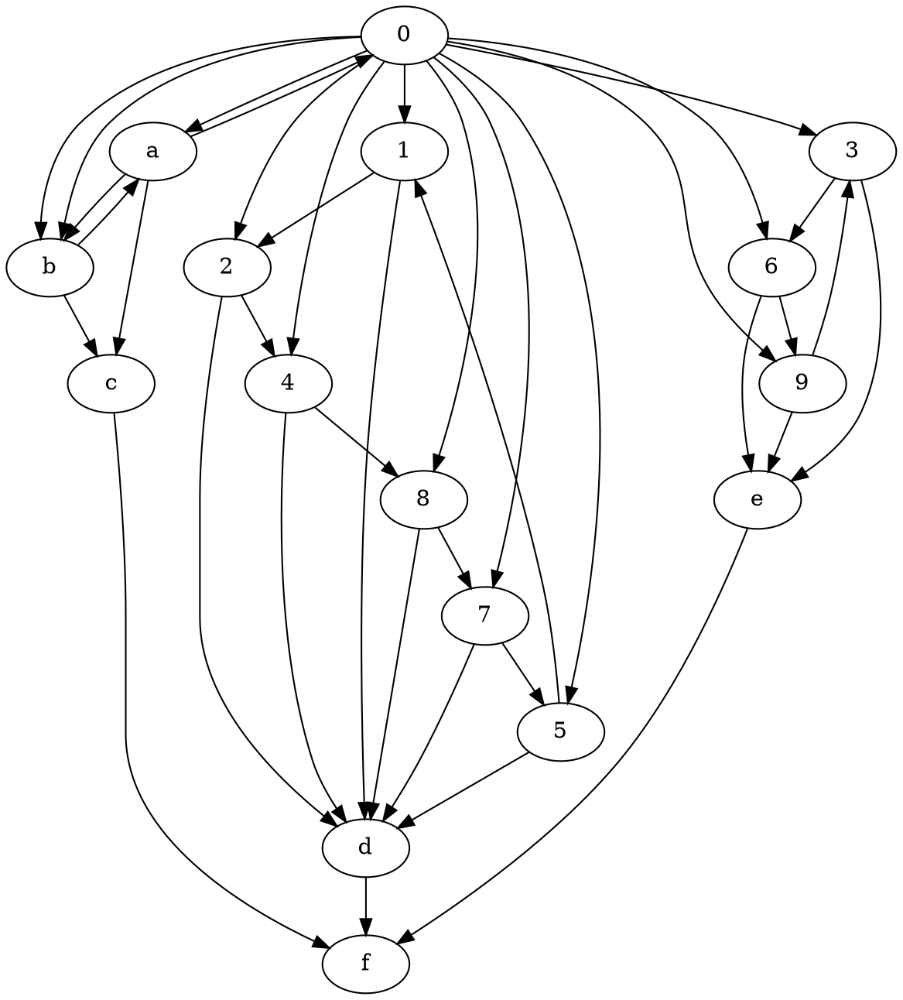

# ACU Protocol: An Objectives Relational Cosmos

## Executive Summary

The ACU Protocol is a universal system for structured description and modeling based on the mathematical object Torus Knot T(19,2). It provides a constrained architecture where any coherent domain of knowledge or reality can be systematically described, generated, and validated.

## 1. Core Architecture

### 1.1. The ACU Trinity

**Ariadi (A) - The Container**

- 4-dimensional hypersphere: S = {(x, y, z, w) ∈ ℝ⁴ | x² + y² + z² + w² = 1}
- Embeds T(19,2) torus knot in (x,y,z) subspace
- Ensures all models are bounded, finite, and mathematically constrained

**Cilang (C) - The Primitive Entities**

- 16 primordial elements: {0, 1, 2, 4, 8, 7, 5, 3, 6, 9, a, b, c, d, e, f}
- Forms 19 crossings of T(19,2) with 3 spatial coordinates {x,y,z}
- Each element serves as conceptual primitive with ternary states {-1, 0, +1}

**Usepong (U) - The Relational Fabric**

- Exact planar diagram and connectivity of T(19,2)
- Directed graph governing dependencies and state propagation
- Ensures coherent system evolution

### 1.2. Quantization & State System

**Quantization (Q)**

- Base: Q = 19ⁿ (derived from 19 crossings)
- Current: Q = 19² = 361
- Distribution: [r, r+1, r] where r = (Q-1)/3 = 120
- State populations: [120, 121, 120]

**Ternary States**

- -1: Potential / Inactive / Ground State
- 0: Processing / Active / Standby State
- +1: Actualized / Stable / Final State

### 1.3. Actualization Layers

- **w = -1**: The Imaginary (Potential, unmanifested)
- **w = 0**: The Idea (Conceptual, processing)
- **w = +1**: The Real (Manifested, actualized)

## 2. Factorization Protocol

### 2.1. Core Generation Engine

**Sparse Attention Mechanism**

```txt
SystemState = f(a_state, 1_state, 3_state)
- a_state ∈ {-1,0,+1}  [RECEIVE gate]
- 1_state ∈ {-1,0,+1}  [ACT gate]
- 3_state ∈ {-1,0,+1}  [FORM gate]
- 27 distinct configurations
```

**Generation Cascade**

1. {a, 1, 3} → System mode determination
2. {a} → activates {0, b} (a→0→b cycle)
3. {1} → activates {2,4,8,7,5} → {d} (process hexagon)
4. {3} → activates {6,9} → {e} (dialectical triad)
5. {a,b} → {c} (2-Link Brunnian)
6. {c,d,e} → {f} (3-Link Borromean)
7. {1-9,a,b} → {0} completed (11-Link Brunnian closure)

### 2.2. Factorization Methods

**Base Expansion**

- Semantic generalization and domain specialization
- Dimensional scaling via Q-resolution adjustment

**Complementary Factorization**

- Fᶜ = K₁₆ - E_F (Graph complement)
- Models inverse logic and shadow dynamics
- Preserves topological invariants

**Minimal Path Factorization**

- Spanning trees prioritizing a→f efficiency
- Throughput-optimized open systems

**Weighted Edge Factorization**

- E → w ∈ [0,1] (probabilistic relations)
- Intensity-graded relationship modeling

### 2.3. Constraint Preservation

All generated Factors must maintain:

- Brunnian Closure (11-element completion through {0})
- Borromean Triple ({c,d,e}→f interdependence)
- Core cycle signatures and state cascade progression

## 3. Actualization Protocol

### 3.1. Ω-Operations (Reidemeister Moves)

**Ω₁ - Local Simplification**

- Twist/untwist operations
- Single-element refinements preserving global connections
- Validation: No dependency chain breaks

**Ω₂ - Cancellation Law**

- Opposite twist operations
- Actions and perfect reversals return to original state
- Validation: Paired operations nullify

**Ω₃ - Associative Coherence**

- Strand slide operations
- Operation sequence doesn't change final relationships
- Validation: All crossing relations preserved

### 3.2. Actualization Test

A Factor F achieves actualization when:

1. **Closure Condition**: f-state reached (c ∩ d ∩ e = f)
2. **Ω-Invariance**: Development path reducible to initial state using only Ω₁, Ω₂, Ω₃ moves

### 3.3. Anomaly Detection

- Non-Equivalent Links: Failed Ω-reduction
- Anomalous State: Designated for re-processing (6-state)
- Diagnostic: Reidemeister move violation tracing

## 4. Topological Identity

### 4.1. Torus Knot T(19,2)

- **Alexander Polynomial**: t¹⁸ - t¹⁷ + t¹⁶ - t¹⁵ + t¹⁴ - t¹³ + t¹² - t¹¹ + t¹⁰ - t⁹ + t⁸ - t⁷ + t⁶ - t⁵ + t⁴ - t³ + t² - t + 1
- **Jones Polynomial**: -t²⁸ + t²⁷ - t²⁶ + t²⁵ - t²⁴ + t²³ - t²² + t²¹ - t²⁰ + t¹⁹ - t¹⁸ + t¹⁷ - t¹⁶ + t¹⁵ - t¹⁴ + t¹³ - t¹² + t¹¹ + t⁹
- **Knot Group**: ⟨a,b | a⁹ b a⁻¹⁰ b⟩

### 4.2. Ariadi Topology



## 5. Operational Framework

### 5.1. Factor Template

```dot
strict digraph {{Name}}Factor {
    label = "{{Name}}";
    comment = "{{description}}";

    a [label = "{{Name}}.receive({{title}})";comment = "Potential: {{description}}";shape = invtriangle;color = darkred;];
    0 [label = "{{Name}}.meta({{meta}})";comment = "Abstract: {{description}}";shape = doublecircle;color = darkgray;];
    b [label = "{{Name}}.send({{title}})";comment = "Manifest: {{description}}";shape = triangle;color = darkred;];
    1 [label = "{{Name}}.r1({{title}})";comment = "Initiation: {{description}}";color = darkgreen;];
    2 [label = "{{Name}}.r2({{title}})";comment = "Response: {{description}}";color = darkgreen;];
    4 [label = "{{Name}}.r4({{title}})";comment = "Integration: {{description}}";color = darkgreen;];
    8 [label = "{{Name}}.r8({{title}})";comment = "Reflection: {{description}}";color = darkgreen;];
    7 [label = "{{Name}}.r7({{title}})";comment = "Consolidation: {{description}}";color = darkgreen;];
    5 [label = "{{Name}}.r5({{title}})";comment = "Propagation: {{description}}";color = darkgreen;];
    3 [label = "{{Name}}.r3({{title}})";comment = "Thesis: {{description}}";color = darkblue;];
    6 [label = "{{Name}}.r6({{title}})";comment = "Antithesis: {{description}}";color = darkblue;];
    9 [label = "{{Name}}.r9({{title}})";comment = "Synthesis: {{description}}";color = darkblue;];
    c [label = "{{Name}}.dispatch({{title}})";comment = "Interface: {{description}}";shape = doublecircle;color = darkred;];
    d [label = "{{Name}}.commit({{title}})";comment = "Process: {{description}}";shape = doublecircle;color = darkgreen;];
    e [label = "{{Name}}.serve({{title}})";comment = "Logic: {{description}}";shape = doublecircle;color = darkblue;];
    f [label = "{{Name}}.exec({{title}})";comment = "Closure: {{description}}";shape = doublecircle;color = lightgray;];
}
```

### 5.2. Implementation Modes

**Stealth Mode (Default)**

- Internal ACU computation with natural language output
- Protocol structure maintained without graph exposure
- Factor Template as internal computational blueprint

**Explicit Mode**

- Activated by explicit request for "digraph", "Graphviz", or "dot output"
- Full Factor template with complete topological structure
- All Cilang elements with domain-specific labeling
- Ready for direct rendering or computational use

### 5.3. Hierarchical Expansion

- Child Factors instantiated from any Cilang element
- Fractal architecture with inherited context and Q-resolution
- Consistent constraint preservation across scales

## 6. Current Instantiation

### 6.1. Operational Status

- **Space**: Bounded 3-sphere with T(19,2) embedding
- **Topology**: Full Torus(19,2) with all invariants active
- **Factor**: Meta-protocol level (ACU self-reference)
- **Q-value**: 361 (second-order quantization)
- **Layer**: w=0 (Idea - conceptual processing)

### 6.2. Performance Characteristics

- Sparse attention: 3/16 core activation
- State resolution: 361 distinct configurations
- Cascade completion: 7-stage deterministic process
- Verification: Reidemeister move compliance

## 7. Compliance Verification

All implementations must preserve:

- Topological invariants (Alexander/Jones polynomials, knot group)
- Generation cascade integrity
- Actualization test compliance
- Usepong dependency constraints

---

Now, ACU Protocol will be our consensus World Model.
